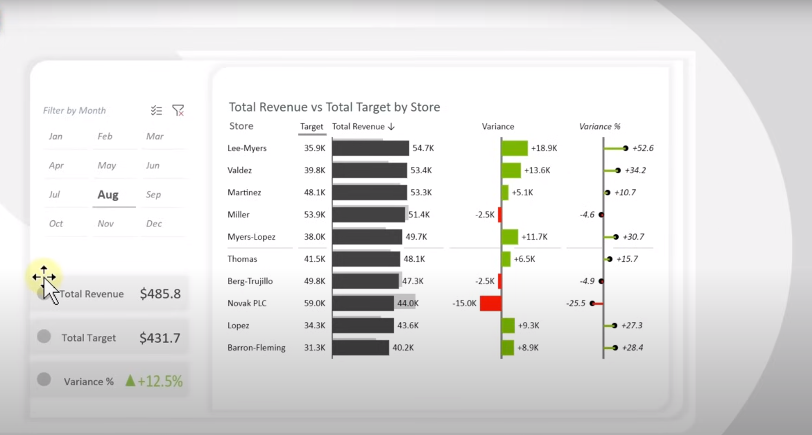

# Data-Analysis-Projects
Welcome to my GitHub repository featuring a diverse range of data analysis projects across Excel, SQL, Tableau, Power BI, and Python. Each project showcases my expertise in leveraging these tools to extract insights, visualize data, and drive informed decision-making.

###  SQL Data Analysis
In my SQL project, I concentrated on two essential phases: data cleaning and exploration. Using SQL queries, I meticulously cleaned the dataset by addressing inconsistencies, handling missing values, and eliminating duplicates. This rigorous process ensured the data was uniform and accurate, laying a solid foundation for analysis.

Following data cleaning, I employed SQL's querying capabilities to explore the dataset. This exploration phase involved querying the data to uncover patterns, trends, and relationships within the dataset itself. By focusing on these fundamental aspects of data preparation and analysis, the project demonstrated SQL's effectiveness in enhancing data quality and facilitating meaningful insights for decision-making processes.

## Excel 
### Overview
This repository contains two Excel projects: a Bike Sales Dashboard and a Revenue vs. Target Dashboard. Both projects utilize Excel's powerful data visualization and analysis tools to provide comprehensive insights into sales and revenue performance.

## Dashboards in Excel
### Bike Sales Dashboard

Description: This dashboard visualizes sales data for bikes, providing insights into sales trends, product performance, and customer demographics.

### Revenue vs. Target Dashboard

Description: This dashboard compares actual revenue against target goals, highlighting performance metrics and areas needing improvement.

##  Tableau

### Overview
This Tableau project by David Nii Armah(me) provides insights into Airbnb listings, focusing on average rental prices, geographic distribution, and revenue trends.

#### Key Insights
- Average Price Per Bedroom: Prices increase with the number of bedrooms.
- Number of Listings by Bedrooms: Distribution of listings categorized by bedroom count.
- Price by Zipcode: Variation in average prices across different zip codes.
- Revenue for Year (2016): Track revenue trends throughout 2016.

#### How to Use
Access the interactive dashboards in the below to explore market trends and make data-driven decisions for optimizing Airbnb listings.

### Dashboard 

[View the full dashboard](https://public.tableau.com/app/profile/david.armah1253/viz/DavidNiiArmahsAirbnbFullProjectinTableau/Dashboard2?publish=yes)

